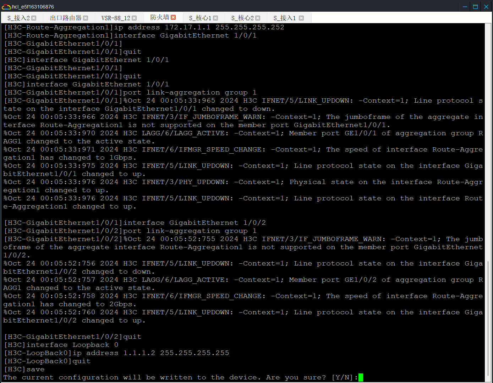

## 局域网组建与维护 
  
某企业网拓扑如图一所示，有两个部门研发部和生产部，分为无线网和有线网，两个部门划分不同的网段地址动态获取。双核心做堆叠增加可靠性，上联防火墙 。由AC控制AP，做本地转发为两个部门下发不同的wifi名。有运营商专线一条设置在出口路由器上提供网络。

# 过程

## 第一步：创建设备
  

## 第二步：连接各设备对应的接口

```yml
# 总部
S_核心1:
  XGE_0/49 = S_核心2 XGE_0/49
  XGE_0/50 = S_核心2 XGE_0/50
  GE_0/3 = S_接入1 GE_0/1
  GE_0/5 = S_接入2 GE_0/1
  GE_0/4 = 防火墙 GE_0/0
  GE_0/6 = AC_7 GE_0/0
S_核心2: # loopback0:1.1.1.3/32
  XGE_0/49 = S_核心1 XGE_0/49
  XGE_0/50 = S_核心1 XGE_0/50
  GE_0/3 = S_接入1 GE_0/2
  GE_0/5 = S_接入2 GE_0/2
  GE_0/4 = 防火墙 GE_0/1
  GE_0/6 = AC_7 GE_0/1
防火墙: # loopback0:1.1.1.1/32, 互联地址: 172.17.1.1/30
  GE_0/0 = S_核心1 GE_0/4
  GE_0/1 = S_核心2 GE_0/4
  GE_0/2 = 出口路由器 GE_0/0

# 研发部: 有线:vlan2:172.17.2.1/24, 无线:vlan3:172.17.3.1/24, 管理地址:vlan100:172.16.100.3/24
S_接入1:
  GE_0/1 = S_核心1 GE_0/3
  GE_0/2 = S_核心2 GE_0/3
  GE_0/3 = PC_1 GE_0/1
  GE_0/4 = AP_1 GE_0/0
PC_1:
  GE_0/1 = S_接入1 GE_0/3
AP_1:
  GE_0/0 = S_接入1 GE_0/4
Phone_13:
  wifi_status = False
  connected_aps = None

# 生产部: 有线:vlan4:172.17.4.1/24, 无线:vlan5:172.17.5.1/24, 管理地址:vlan100:172.16.100.3/24
S_接入2:
  GE_0/1 = S_核心1 GE_0/5
  GE_0/2 = S_核心2 GE_0/5
  GE_0/3 = PC_2 GE_0/1
  GE_0/4 = AP_2 GE_0/0
PC_2:
  GE_0/1 = S_接入2 GE_0/3
AP_2:
  GE_0/0 = S_接入2 GE_0/4

# AC 无线管理地址: vlan6:172.17.6.254/24
AC_7:
  GE_0/0 = S_核心1 GE_0/6
  GE_0/1 = S_核心2 GE_0/6

# 出口路由器, 互联地址:172.17.1.2/30, 公网地址:36.249.156.161/30, loopback0:1.1.1.1/32
出口路由器:
  GE_0/0 = 防火墙 GE_0/2
  GE_0/1 = VSR-88_12 GE_0/0
# VSR-88: 公网地址:36.249.156.162/30, loopback0:114.114.114.114/32
VSR-88_12:
  GE_0/1 = 出口路由器 GE_0/1
```

## 第三步：配置设备

右键选择启动设备,右键选择进入命令行终端

### 可靠性需求

#### 1.总部两台核心交换机配置IRF堆叠，并且按照拓扑要求配置三层链路聚合设置好IP地址和loopback(1.1.1.3/32)地址。

##### 配置核心交换机 IRF 堆叠
S_核心1
```sh
system-view # 进入系统视图模式，允许对设备进行配置
sysname s_core1 # 配置设备名称为 s_core1
# 修改成员编号
irf member 1 renumber 1 # 将 IRF 成员 1 的编号设置为 1。这个编号用于标识 IRF 堆叠中的成员
# 设置优先级
irf member 1 priority 30 # 设置 IRF 成员 1 的优先级为 30。优先级越高，该成员在 IRF 堆叠中的地位越高
# 关闭端口 int ran XGE1/0/49 to XGE1/0/50; shutdown
int ran XGE1/0/49 to XGE1/0/50
shutdown
# 设置 IRF 端口, 第一个数字是 IRF 成员编号，第二个数字是 IRF 端口编号
irf-port 1/1 # 进入 IRF 端口 1/1 的配置模式。IRF 端口用于连接 IRF 堆叠中的其他成员
port group interface XGE1/0/49 # 将 Ten-GigabitEthernet 1/0/49 接口添加到 IRF 端口组中。这个接口将用于 IRF 堆叠连接
port group interface XGE1/0/50 # 将 Ten-GigabitEthernet 1/0/50 接口添加到 IRF 端口组中。这个接口也将用于 IRF 堆叠连接
# 开启端口: int ran XGE1/0/49 to XGE1/0/50
int ran XGE1/0/49 to XGE1/0/50
undo shutdown
# 激活保存
irf-port-configuration active # 激活 IRF 端口配置
save # 确保设备重启后配置不会丢失
```
  
  

S_核心2
```sh
# 将 IRF 成员 1 的编号设置为 2。这个编号用于标识 IRF 堆叠中的成员
display interface brief
system-view
irf member 1 renumber 2
save
quit
reboot
display interface brief
system-view
irf member 2 priority 20
# 关闭接口
int ran XGE2/0/49 to XGE2/0/50
shutdown
# 配置 IRF 端口
irf-port 2/2
port group interface XGE2/0/49
port group interface XGE2/0/50
# 重新启用接口
int ran XGE2/0/49 to XGE2/0/50
undo shutdown
# 激活 IRF 端口配置
irf-port-configuration active
# 配置 Loopback 接口
interface Loopback 0  # 进入 Loopback 0 接口的配置模式。Loopback 接口是一种虚拟接口，通常用于管理和测试目的
ip address 1.1.1.3 255.255.255.255 # 为 Loopback 0 接口配置 IP 地址 1.1.1.3，子网掩码为 255.255.255.255。Loopback 接口的 IP 地址通常用于设备管理和路由协议。
quit
save
# 检查
display irf
```
将 IRF 成员 1 的编号设置为 2。这个编号用于标识 IRF 堆叠中的成员
  
配置 IRF 端口
  
配置 Loopback 接口
  

#### 2.核心和接入之间均采用链路聚合的方式进行部署，设置核心互联口二层链路聚合，设置聚合口为trunk和放通必要vlan 
S_核心1
```sh
system-view
# 配置二层链路聚合
interface Bridge-Aggregation 1
port link-type trunk
port trunk permit vlan all
interface GigabitEthernet 1/0/3
port link-aggregation group 1
interface GigabitEthernet 1/0/5
port link-aggregation group 1
quit
save
```
  
S_核心2
```sh
system-view
# 配置二层链路聚合
interface Bridge-Aggregation 1
port link-type trunk
port trunk permit vlan all
interface GigabitEthernet 2/0/3
port link-aggregation group 1
interface GigabitEthernet 2/0/5
port link-aggregation group 1
quit
save
```
同 S_核心1

S_接入1
```sh
system-view
# 配置二层链路聚合
interface Bridge-Aggregation 1
port link-type trunk
port trunk permit vlan all
interface GigabitEthernet 1/0/1
port link-aggregation group 1
interface GigabitEthernet 1/0/2
port link-aggregation group 1
quit
save
```
  
S_接入2
```sh
system-view
# 配置二层链路聚合
interface Bridge-Aggregation 1
port link-type trunk
port trunk permit vlan all
interface GigabitEthernet 1/0/1
port link-aggregation group 1
interface GigabitEthernet 1/0/2
port link-aggregation group 1
quit
save
```
同 S_接入1

#### 3.防火墙与核心用三层链路聚合口并设置好IP。出口路由器(36.249.156.161/30,loopback0:1.1.1.1/32)和防火墙设置好互联地址(172.17.1.0/30)和loopback(1.1.1.2/32)地址。

##### 配置防火墙与核心交换机链路聚合
防火墙
```sh
system-view
# 配置三层链路聚合
interface Route-Aggregation 1
ip address 172.17.1.1 255.255.255.252
# 配置物理接口加入链路聚合组
interface GigabitEthernet 1/0/1
port link-aggregation group 1
quit
interface GigabitEthernet 1/0/2
port link-aggregation group 1
quit
# 配置 Loopback 接口
interface Loopback 0
ip address 1.1.1.2 255.255.255.255
quit
save
```
  
  

##### 配置出口路由器与防火墙互联
出口路由器
```sh
system-view
# 配置互联地址：
interface GigabitEthernet 0/0
ip address 172.17.1.2 255.255.255.252
quit
# 配置 Loopback 接口
interface Loopback 0
ip address 1.1.1.1 255.255.255.255
quit
# 配置公网地址
interface GigabitEthernet 0/1
ip address 36.249.156.161 255.255.255.252
quit
save
```
  

### 连通性需求
##### 4.核心交换机配置有线无线的dhcp，研发部有线网络:vlan2 172.17.2.1/24。研发部无线网络：vlan3 172.17.3.1/24。AP的管理地址池:vlan 6:172.17.6.1/24，并排除AC管理AP的地址。设备管理地址vlan100：172.16.100.1 24，以上所有的地址段网关都是第一个可用地址。
###### 配置 DHCP
核心交换机 (选择其中一个即可)
```sh
system-view
# 启用 DHCP 服务
dhcp enable
# 配置 VLAN 2 的 DHCP 池
dhcp server ip-pool vlan2
network 172.17.2.0 mask 255.255.255.0
gateway-list 172.17.2.1
quit
# 配置 VLAN 3 的 DHCP 池
dhcp server ip-pool vlan3
network 172.17.3.0 mask 255.255.255.0
gateway-list 172.17.3.1
quit
# 配置 VLAN 6 的 DHCP 池
dhcp server ip-pool vlan6
network 172.17.6.0 mask 255.255.255.0
gateway-list 172.17.6.1
dhcp server forbidden-ip 172.17.6.254
quit
# 配置 VLAN 100 的 DHCP 池
dhcp server ip-pool vlan100
network 172.16.100.0 mask 255.255.255.0
gateway-list 172.16.100.1
quit
save
```
  

##### 配置接入交换机
S_接入1
```sh
system-view
# 创建 VLAN
vlan 2
vlan 3
# 配置 VLAN 和接口模式
interface GigabitEthernet 1/0/3
port link-type access
port access vlan 2
quit
interface GigabitEthernet 1/0/4
port link-type access
port access vlan 3
quit
save
```
  

S_接入2
```sh
system-view
# 创建 VLAN
vlan 4
vlan 5
# 配置 VLAN 和接口模式
interface GigabitEthernet 1/0/3
port link-type access
port access vlan 4
quit
interface GigabitEthernet 1/0/4
port link-type access
port access vlan 5
quit
save
```
#### 5.接入交换机下联为电脑和AP的口设置vlan选择合适的接口模式。AC设置好管理地址，设置AP自动上线。研发部无线服务模板名称为1，无线名研发部，密码yanfa12345678,网段vlan2 172.17.3.1/24。生产部部无线服务模板名称为2，无线名生产部，密码shengchan12345678	网段vlan5 172.17.3.1/24。
AC
```sh
system-view
vlan 6
# 配置管理地址
interface Vlan-interface 6
ip address 172.17.6.254 255.255.255.0
quit
# 配置 AP 自动上线
wlan auto-ap enable
quit
save
# 配置无线服务模板
wlan service-template 1
ssid 研发部
preshared-key pass-phrase simple yanfa12345678
vlan 3
quit
wlan service-template 2
ssid 生产部
preshared-key pass-phrase simple shengchan12345678
vlan 5
quit
save
```
配置管理地址 和 AP 自动上线
  
配置无线服务模板
  

#### 6.防火墙与核心互联的口设置为trust，到出口路由器的口设置为Untrust，设置好安全策略trust到UNtrust，并且只允许研发部上外网，生产部不允许上外网。
防火墙
```sh
system-view
# 创建安全区域 and 将接口添加到安全区域
security-zone name Trust
import interface Bridge-Aggregation 1 vlan 1 to 4094
security-zone name Untrust
import interface Route-Aggregation 1
quit
# 配置安全策略
zone-pair security source Trust destination Untrust
quit
# 配置只允许研发部上外网，生产部不允许上外网
object-policy ip manage
acl number 3000
rule 10 permit ip source 172.17.2.0 0.0.0.255
rule 20 deny ip source 172.17.4.0 0.0.0.255
quit
# 配置安全策略并应用 ACL
zone-pair security source Trust destination Untrust
packet-filter 3000
quit
save
```
  

### 安全性需求
所有设备配置ssh远程加密传输协议，用户名admin,密码Admin@1234
```sh
system-view
# 配置 SSH
ssh server enable
local-user admin class manage
password simple Admin@1234
service-type ssh
authorization-attribute user-role network-admin
quit
line vty 0 4
authentication-mode scheme
user-role network-admin
quit
save
```
  

#### 配置 VSR-88
```sh
system-view
display interface brief
# 配置公网地址
interface GigabitEthernet 0/0/0
ip address 36.249.156.162 255.255.255.252
quit
# 配置 Loopback 接口
interface Loopback 0
ip address 114.114.114.114 255.255.255.255
quit
save
```
  
