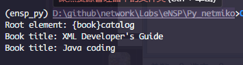
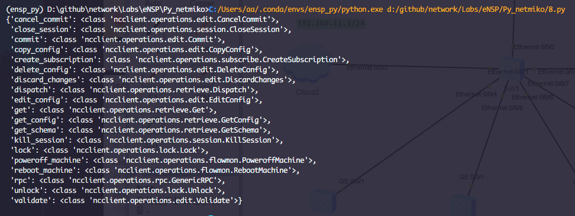
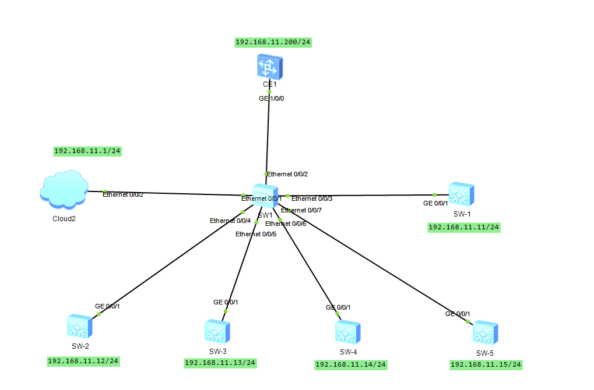
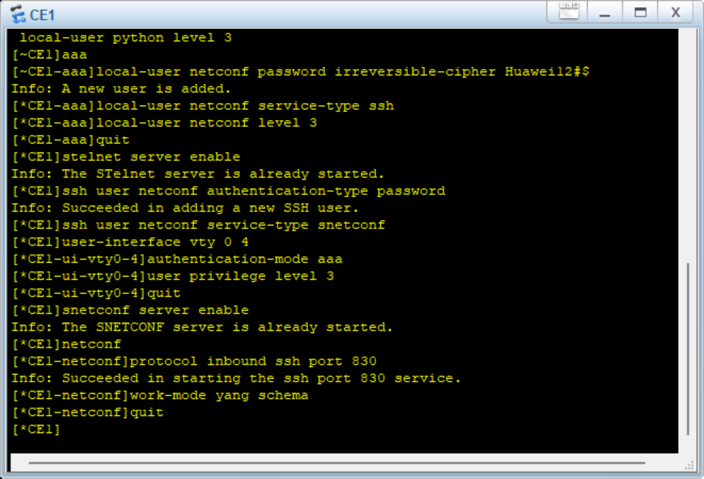

实 训 报 告

专业：计算机网络技术                课程：网络系统运行与维护

实训序号：7	实训名称：使用python配置netconf服务	成绩：
班级：	学号：	姓名：

一、实训目标：
- 会处理JSON格式的数据
- 会使用netmiko模块

二、实训内容及操作步骤：

（一）XML语法规则及操作（请按要求填写命令，粘贴结果图）
1、XML文档必须有一个根元素吗？

A. 不需要

B. 必须有

2、XML文档中的元素标签是否区分大小写？
A. 不区分
B. 区分

3、XML文档的第一行通常是什么？ B

A. `<root>`

B. `<?xml version="1.0" encoding="UTF-8"?>`

C. <!DOCTYPE>

4、在XML文档中，注释的语法是什么？ A

A. `<!-- 注释 -->`

B. <!- 注释 ->

C. /* 注释 */

5、XML文档中的元素是否可以嵌套？ A

A. 可以

B. 不可以

6、XML文档中的元素可以有___属性____，它们用来传递额外的信息。

7、XML文档中的每个元素都必须有___结束标签_____。

8、给定以下XML文件，请编写一个Python脚本使用ElementTree模块解析该文件，首先打印出根元素的标签名，其次遍历所有元素打印出所有书名。

范例：

执行命令截图：
```py name='8.py'
import xml.etree.ElementTree as ET

# 解析XML文件
tree = ET.parse('xml1.xml')
root = tree.getroot()

# 打印根元素的标签名
print(f"Root element: {root.tag}")

# 命名空间
namespace = {'ns': 'book'}

# 遍历所有元素并打印书名
for book in root.findall('ns:book', namespace):
    title = book.find('ns:title', namespace).text
    print(f"Book title: {title}")
```
```sh
python 8.py
```

验证结果图：

  


（二）安装ncclient并查看支持的操作（请按要求填写命令，粘贴结果图）
1.通过Anaconda Prompt在虚拟环境ensp_py下安装ncclient包，并查看支持的操作信息：
执行命令截图：

安装ncclient包

```sh
conda activate ensp_py
pip install ncclient
```
查看ncclient支持的操作信息
```py
from ncclient import manager
from pprint import pprint
pprint(manager.OPERATIONS)
```

验证结果图：
  


（三）综合实践
准备操作：按照前期准备操作中步骤绘制网络拓扑图并配置网段。
1. 参考实验指导说明书，基于指导教师给的网络拓扑图(eNSP)截图，配置局域网，并通过ncclient模块获取网络中指定设备的配置。需要完成的任务如下。 

     （1）创建网络拓扑图并配置参数。

     （2）配置设备SSH服务及NETCONF服务。

     （3）编写Python脚本。

     （4）运行Python脚本。
其中，拓扑图如下：

  

路由器CE1配置SSH及Netconf服务的截图：
```sh
# <CE1>
display current-configuration | include ssh
display current-configuration | include local-user
display current-configuration | include netconf

sys
# [~CE1]
user-interface vty 0 4
# [~CE1-ui-vty0-4]
authentication-mode aaa
user privilege level 3
protocol inbound ssh port 22
#  [*CE1-ui-vty0-4]
quit
# [*CE1]
# 配置SSH服务
aaa
# [*CE1-aaa]
local-user ncuser password irreversible-cipher Huawei12#$
local-user ncuser service-type ssh
local-user ncuser level 3
quit
# [*CE1]
# ssh user ncuser service-type snetconf
ssh user ncuser service-type stelnet
ssh authentication-type default password
ssh user ncuser authentication-type password
stelnet server enable

ssh user ncuser authentication-type password
ssh user ncuser service-type snetconf

# [~CE1-ui-vty0-4]
authentication-mode aaa
user privilege level 3
quit

# 配置Netconf服务
snetconf server enable
netconf
# [~CE1-netconf]
protocol inbound ssh port 830
work-mode yang schema
quit

display ip interface brief
display interface brief
```

  

```sh
# 检查 CE1
display ip interface brief
display current-configuration | include netconf
display current-configuration | include ssh
display current-configuration | include local-user
display ssh server status
display user-interface
```
```sh
# @windows(我的物理机)
ping 192.168.11.200
ssh netconf@192.168.11.200 -p 830
```

Python代码截图：

```py
with manager.connect(
    host='192.168.11.200',  # 替换为你的设备IP地址
    port=830,
    username='netconf',  # 替换为你的用户名
    password='Huawei12#$',  # 替换为你的密码
    hostkey_verify=False,
    device_params={'name': 'huaweiyang'},  # 指定设备类型
    allow_agent=False,
    look_for_keys=False,
    timeout=30,  # 增加超时时间
) as m:
    # 获取设备配置
    # config = m.get_config(source='running').data_xml
    config = m.get().data_xml
    print(config)
```

执行结果截图：
