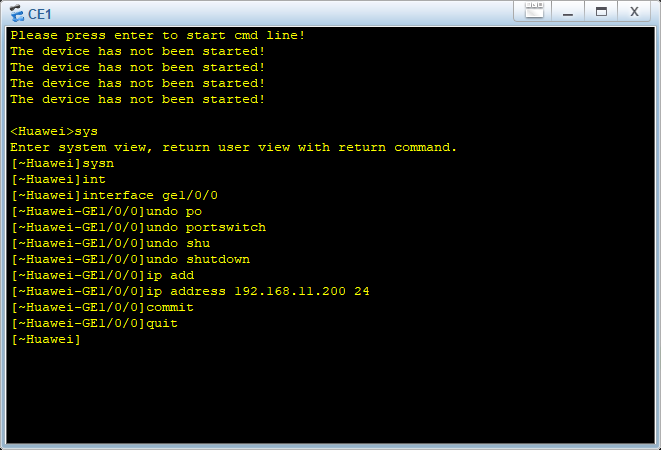
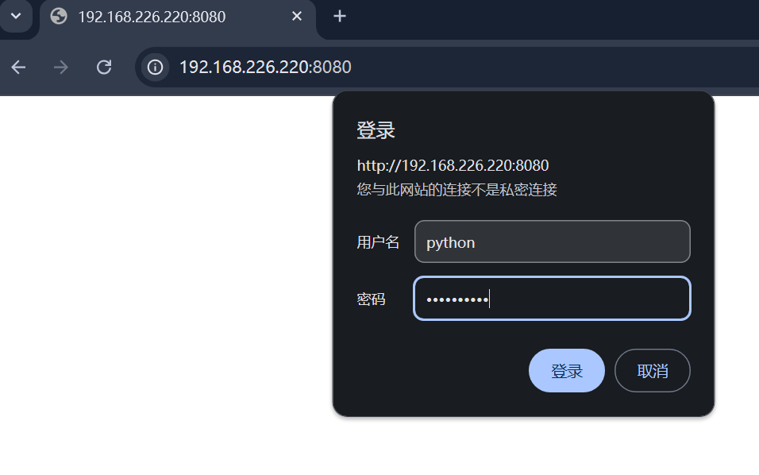
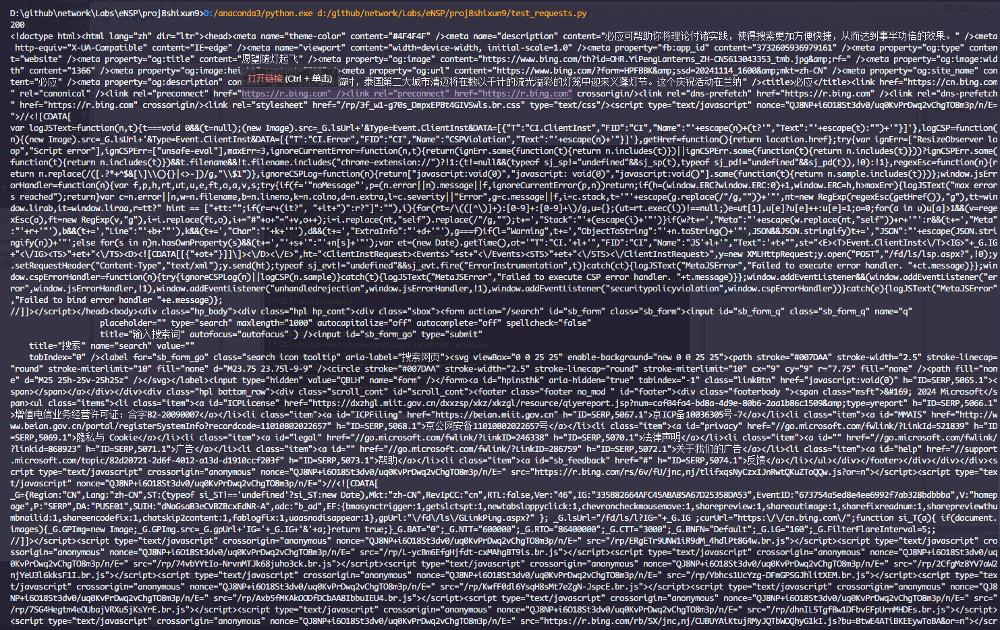
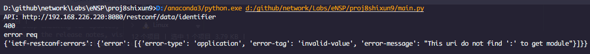
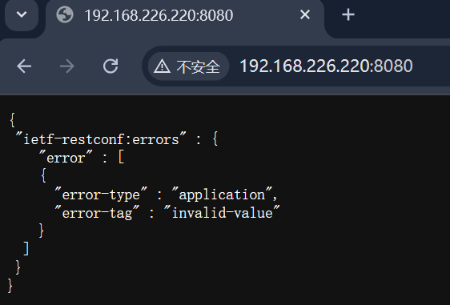

# 实 训 报 告

专业：计算机网络技术                课程：网络系统运行与维护

|实训序号：8	|实训名称：使用telemetry实时监控CPU和内存使用率|	成绩： |
|:----:|:----:|:----:|
|班级：|	学号：|	姓名：|

## 一、实训目标：
- 会使用HTTP
- 会使用requests模块
- 会使用RESTCONF协议
## 二、实训内容及操作步骤：

### （一）HTTP协议基础及报文格式（请按要求填写命令，粘贴结果图）

1、HTTP代表什么？

A. HyperText Transfer Protocol\
B. Hypertext Terminal Protocol\
C. High Transfer Protocol\
D. Hyper Transfer Protocol

正确答案： A

2、HTTP工作在哪一层？

A. 应用层\
B. 传输层\
C. 网络层\
D. 数据链路层

正确答案：A

3、HTTP默认端口号是多少？

A. 21\
B. 80\
C. 443\
D. 25

正确答案： B

4、以下哪个HTTP状态码表示“未授权”？

A. 401 Unauthorized\
B. 403 Forbidden\
C. 404 Not Found\
D. 500 Internal Server Error

正确答案： A

5、HTTP响应报文的组成部分不包括（  ）？（多选）

A. 状态行\
B. 响应头部\
C．响应数据\
D．响应正文

正确答案：C,D

6. 构造一个GET请求，请求URL为https://api.example.com/data?param=value，并在控制台中显示完整的请求报文。要求如下：
- 请求行应该包含请求方法、URL路径以及HTTP版本号。
- 请求头可以为空或者包含必要的头部字段。
- 请求体在这种情况下是空的。

请求报文：

```sh
GET /data?param=value HTTP/1.1
Host: api.example.com
```

7. 假设你收到如下所示的一个HTTP响应，解析并提取出状态码、响应头中的Content-Type字段以及响应体。

响应报文：
```sh
HTTP/1.1 200 OK
Date: Fri, 04 Oct 2024 10:36:00 GMT
Server: Apache/2.4.41 (Ubuntu)
Content-Type: application/json
Content-Length: 204
Connection: close
{
  "status": "success",
  "message": "Data fetched successfully",
  "data": {
    "item": [
      {"id": 1, "value": "one"},
      {"id": 2, "value": "two"}
    ]
  }
}
```
解析结果：
```py
response_text = """HTTP/1.1 200 OK
Date: Fri, 04 Oct 2024 10:36:00 GMT
Server: Apache/2.4.41 (Ubuntu)
Content-Type: application/json
Content-Length: 204
Connection: close

{
  "status": "success",
  "message": "Data fetched successfully",
  "data": {
    "item": [
      {"id": 1, "value": "one"},
      {"id": 2, "value": "two"}
    ]
  }
}
"""

# 分割响应报文的头部和主体
header_text, body = response_text.split('\n\n', 1)

# 分割头部的每一行
header_lines = header_text.split('\n')

# 提取状态码
status_line = header_lines[0]
status_code = status_line.split(' ')[1]

# 提取Content-Type字段
content_type = None
for line in header_lines:
    if line.startswith('Content-Type'):
        content_type = line.split(': ')[1]
        break

print(f"状态码: {status_code}")
print(f"Content-Type: {content_type}")
print(f"响应体: {body}")
```
状态码: 200
Content-Type: application/json
响应体: 
```json
{
  "status": "success",
  "message": "Data fetched successfully",
  "data": {
    "item": [
      {"id": 1, "value": "one"},
      {"id": 2, "value": "two"}
    ]
  }
}
```

### （二）配置交换机CE12800开启RESTCONF服务（请按要求填写命令，粘贴结果图）
1. 根据指导教师给出网络拓扑图，配置CE12800设备开启RESTCONF服务，选择HTTP普通服务。其中用户名为Python，密码为Huawei@123，HTTP端口为8080。

执行命令截图：
```sh
# CE1配置ip地址和端口信息
sys
sysname CE1
interface GE1/0/0
undo portswitch
undo shutdown
ip address 192.168.226.200 24
commit
quit
```
  
```sh
# CE1配置HTTP服务
sys
aaa
local-user python password cipher Huawei@123
local-user python service-type http
commit
quit
```
```sh
# CE1配置RESTCONF服务，端口配置为8080
http
service restconf
server enable
server port 8080
commit
quit
vm-manager
```

验证结果图(查看设备当前配置是否开启HTTP)：
  

### （三）安装requests并验证（请按要求填写命令，粘贴结果图）
1.通过Anaconda Prompt在虚拟环境ensp_py下安装requests包，并通过向www.bing.com发送请求，打印返回值方式验证requests模块功能。
执行命令截图：
```py
import requests

response = requests.get('https://www.bing.com')
print(response.status_code)
print(response.text)
```

HTTP请求结果图：
  

### （四）综合实践
1. 参考实验指导说明书，基于指导教师给的网络拓扑图，配置CE12800开启RESTCONF服务，并通过requests模块登陆该设备。需要完成的任务如下。 
- （1）在网络拓扑图中配置CE12800设备的RESTCONF服务及本地账户,用户名：python, 密码：-Hi@123。
- （2）通过浏览器输入URL登陆CE12800设备。
- （3）编写Python脚本实现自动登入CE12800设备。
- （4）运行Python脚本。

其中，拓扑图如下：

运行结果示例：

Python代码运行截图：
  
浏览器直接登陆结果截图：

  
 
