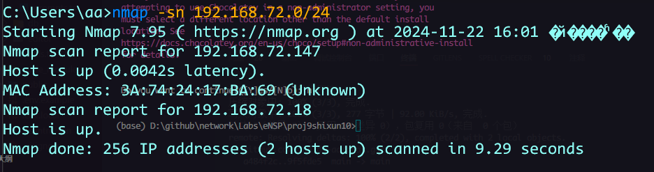
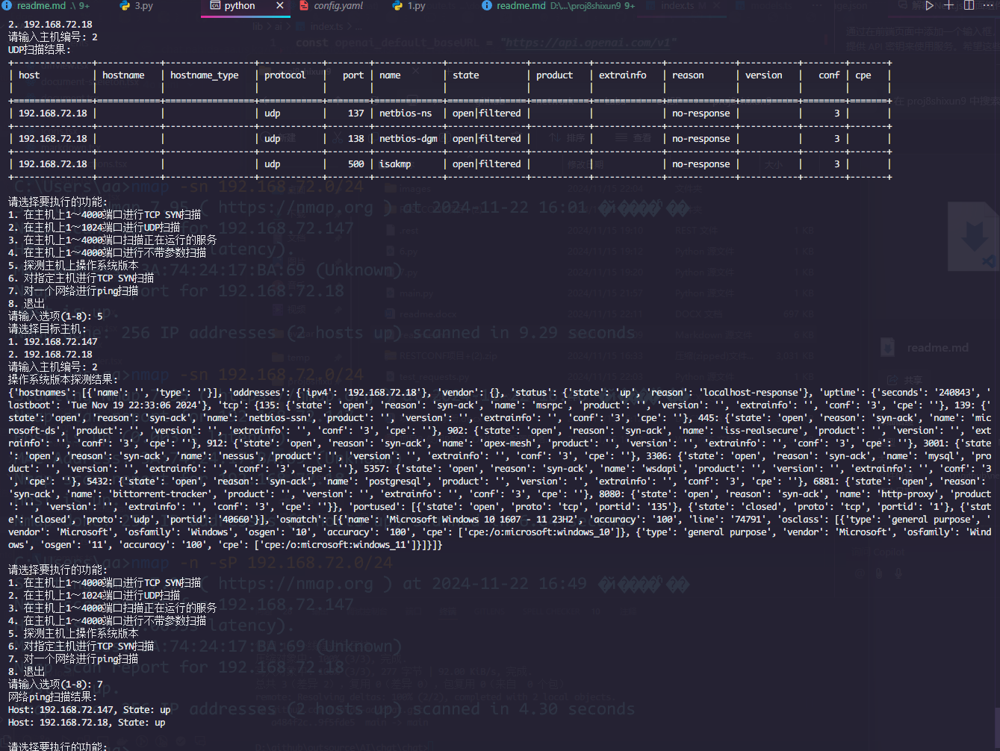

# 实 训 报 告

专业：计算机网络技术                课程：网络系统运行与维护

|实训序号：10	|实训名称：网络自动化运维常用工具|	成绩： |
|:----:|:----:|:----:|
|班级：|	学号：|	姓名：|

## 一、实训目标：

- 了解YAML配置文件基本概念
- 了解Ansible基本概念
- 了解Ansible playbook基本内容及流程控制语法
- 了解Nornir模块的基本概念、安装和使用方法
- 了解Scapy模块基本概念、安装和使用方法
- 掌握Nmap模块的基本概念、安装和使用方法

## 二、实训内容及操作步骤：

### （一）使用Python解析指定YAML文件（请按要求填写命令，粘贴结果图）

1、通过Anaconda Prompt在虚拟环境ensp_py下安装PyYAML包，随后将下列YAML文件中数据通过PyYAML模块解析成Python数据并打印出结果。

文件： [test2.yaml](test2.yaml)

```py
import yaml # pip install pyyaml

# 读取YAML文件
with open('test2.yaml', 'r', encoding='utf-8') as file:
    data = yaml.safe_load(file)

# 打印解析结果
print(data)
```

解析结果截图：

  

2、在题目1的基础上，将下列Python数据通过PyYAML模块写入到config.yaml文件中。

Python数据：
```py
data = {
    'hash':
     {
         'name': 'Steve',
         'foo': 'bar'
      }
}
```
写入文件内容的截图：

  

### （二）使用Nmap软件扫描个人主机的操作系统版本及当前网络内的主机列表（请按要求填写命令，粘贴结果图）

1. 首先通过命令行查看当前个人主机的IP地址，示例如下图所示。随后安装Nmap软件并完成当前个人主机IP地址的操作系统版本探测、主机列表扫描。

```sh
ipconfig
choco install nmap
nmap -O 192.168.72.18
nmap -sn 192.168.72.0/24
```

操作系统探测结果截图：

  

  

主机列表扫描结果图：

  

### （三）综合实践

1.参考教材12.4节内容，首先在Anaconda Prompt在虚拟环境ensp_py下安装python-nmap包，并通过python-nmap模块实现对指定服务器的运行状态扫描，需要完成的任务如下。

（1）在主机上1～4000端口进行TCP SYN扫描。\
（2）在主机上1～1024端口进行UDP扫描。\
（3）在主机上1～4000端口扫描正在运行的服务。\
（4）在主机上1～4000端口进行不带参数扫描。\
（5）探测主机上操作系统版本。\
（6）对指定主机进行TCP SYN扫描。\
（7）对一个网络进行ping扫描。

运行结果示例：

```sh
pip install python-nmap
```

Python代码截图：

  
  
  

分别测试功能2、5、7的结果截图：

  
