# 实 训 报 告

专业：计算机网络技术       课程：网络系统运行与维护

|实训序号：8 | 实训名称：使用telemetry实时监控CPU和内存使用率 | 成绩： |
|---|---|---|
|班级:|学号:|姓名:|

## 一、实训目标：

- 会使用YANG建模语言
- 会配置Telemetry订阅数据
- 会使用Telemetry技术

## 二、实训内容及操作步骤：

### （一）使用pyang模块检查YANG文件树结构（请按要求填写命令，粘贴结果图）

1、在YANG模块中，声明其他模块的引用应该使用哪个关键字？

A. import\
B. include\
C. module\
D. belongs-to

正确答案： A

2、在YANG中，leaf语句定义的是什么？

A. 单个数据值\
B. 容器\
C. 列表项\
D. 数据类型

正确答案： A

3、XML文档的第一行通常是什么？

A. `<root>` \
B. `<?xml version="1.0" encoding="UTF-8"?>` \
C. `<!DOCTYPE>`

正确答案： B

4、YANG模型由一个模型和无数的叶子节点、（  ）组成的描述整个设备的一棵树？（多选题）

A. 节点列表\
B. 叶子列表\
C. 容器节点\
D. 根节点

正确答案： B、C、D

5、目前华为设备支持的YANG模型有（  ）？

A. HUAWEI-YANG\
B. OPEN-YANG\
C．IETF-YANG\
D．OPENCONFIG-YANG

正确答案： A、C、D

6.通过Anaconda Prompt在虚拟环境ensp_py下安装pyang包，并查看帮助说明：

执行命令截图：
```sh
conda activate ensp_py
pip install pyang
pyang --help
```

验证结果图：

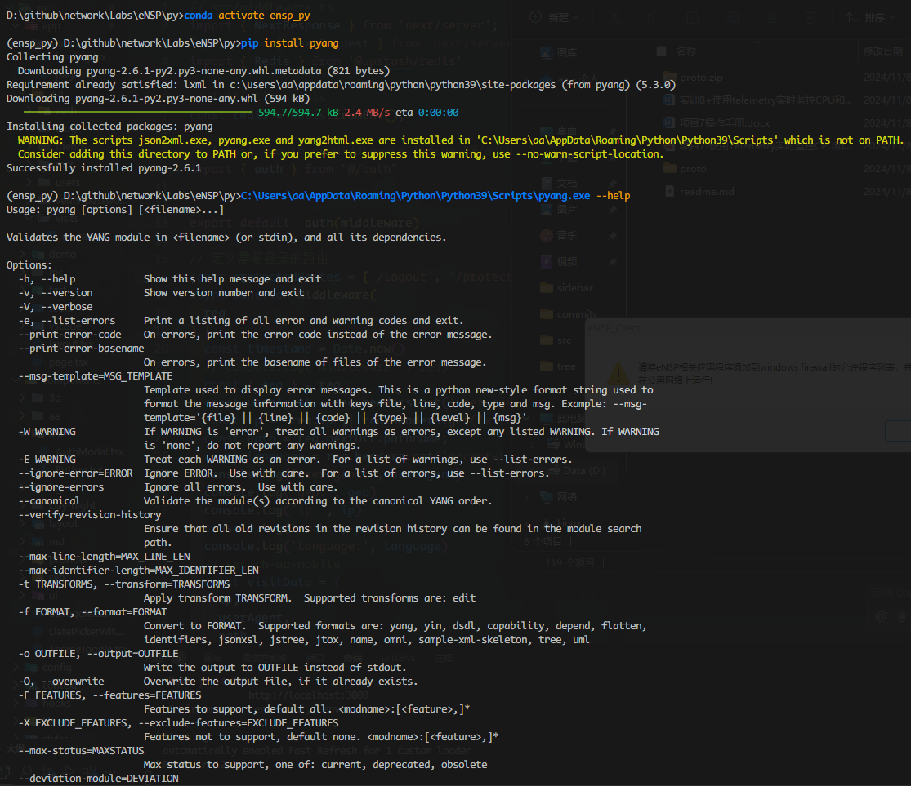  


7.通过pyang包，输出下列 config-interface.yang 文件的Tree结构并将其转换为yin文件。

Tree结构截图：
```sh
pyang -f tree config-interface.yang
```
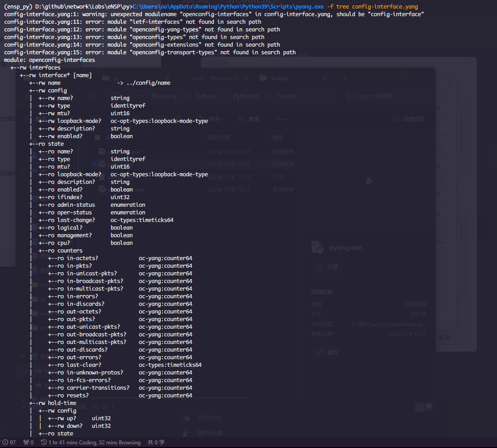  

Yin文件截图：
```sh
pyang -f yin -o config-interface.yin config-interface.yang
```
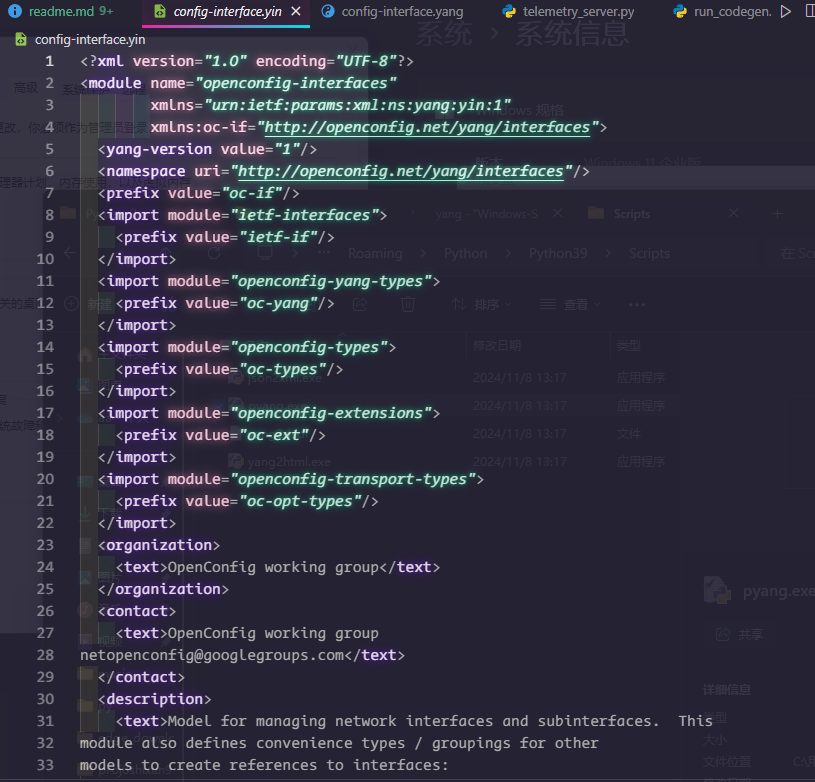  

### （三）综合实践
1. 参考实验指导说明书，基于指导教师给的网络拓扑图截图，配置局域网，并通过telemetry静态订阅方式监控CE12800设备的CPU使用率。需要完成的任务如下。 

- （1）创建网络拓扑图并配置参数。
- （2）配置CE12800设备SSH服务及Telemetry静态订阅服务。
- （3）编写Python脚本。
- （4）运行Python脚本。
其中，拓扑图如下：
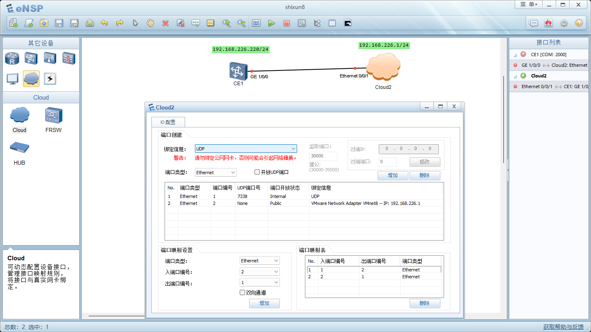  

```sh
# 
sys
sysname CE1
vlan 10
commit
q
#
interface Vlanif10
ip address 192.168.226.220
commit
interface GigabitEthernet1/0/0
undo shutdown
port default vlan 10
commit
q
```
第一次配置时忘了配置ip, 之后通过检查发现问题并修改配置。
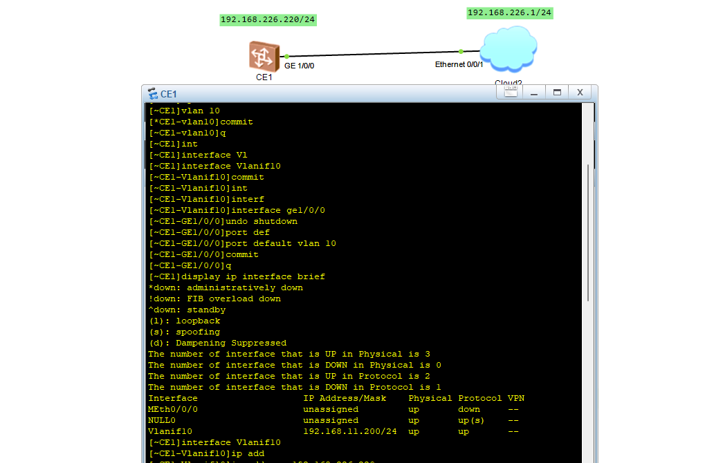  
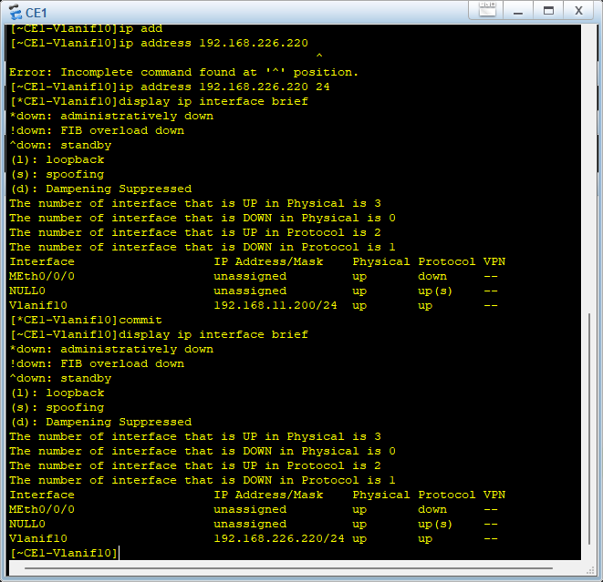  
本地主机 ping CE1 的截图：
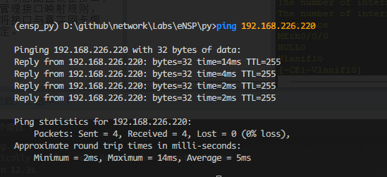  

交换机CE1配置动态订阅服务的截图：
```sh
sys
telemetry
destination-group dst1
ipv4-address 192.168.226.1 port 30000 protocol grpc no-tls
commit
display telemetry destination
```
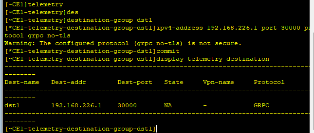  
```sh
# 创建传感器组
sensor-group ssr1
sensor-path huawei-devm:devm/cpuInfos/cpuInfo
commit
display telemetry sensor
display telemetry sensor-path
```
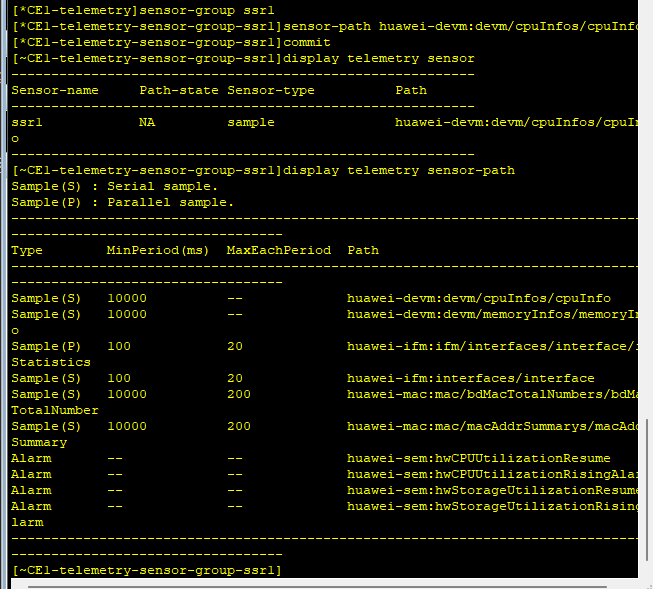  
```sh
#静态订阅
subscription sbc1
sensor-group ssr1 sample-interval 1000
destination-group dst1
commit
display telemetry subscription
display telemetry destination
```
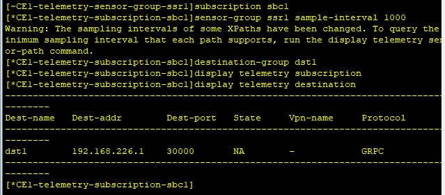  
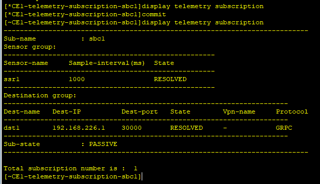  

Python代码截图：
  


执行结果截图：

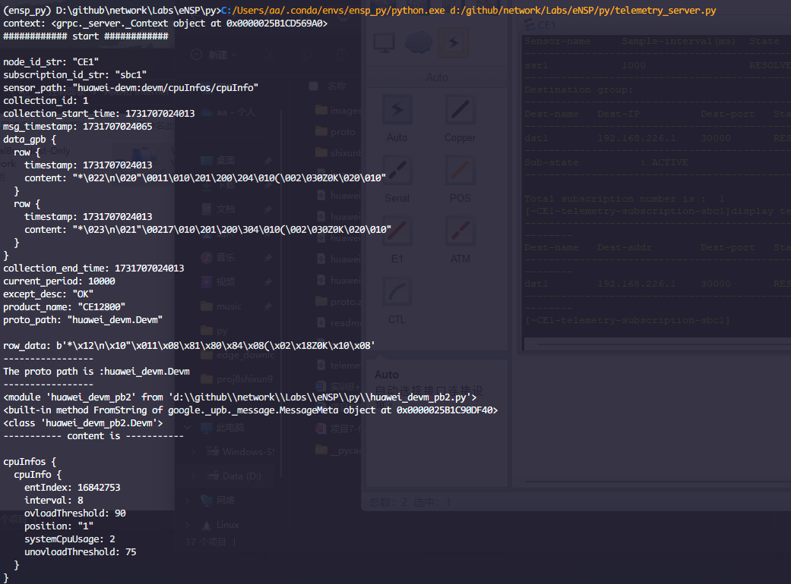  
