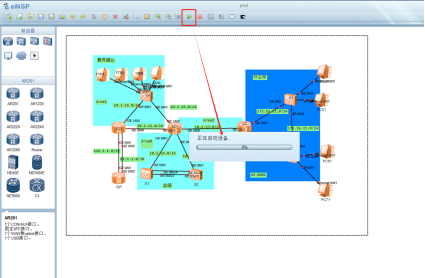

# PySNMP

## 实训6 PySNMP 获取网络数据
专业:计算机网络技术, 课程: 网络系统运行和维护

### 一 实训目标(实验目的)
- 会使用 JSON 格式的数据
- 会使用 netmiko 模块(库)

### 二 实训内容
前期准备操作:
1、使用eNsp软件打开指导教师提供的项目3网络拓扑图,并启动所有设备(已配置过的可以跳过当前准备)：
  
2、添加Cloud主机，并配置端口：