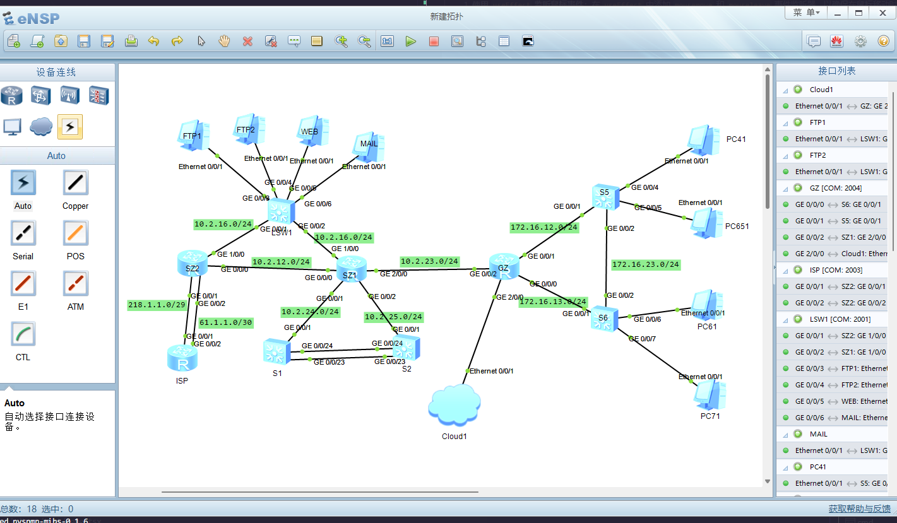
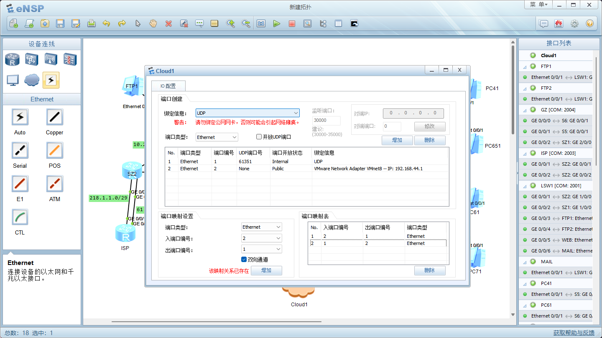
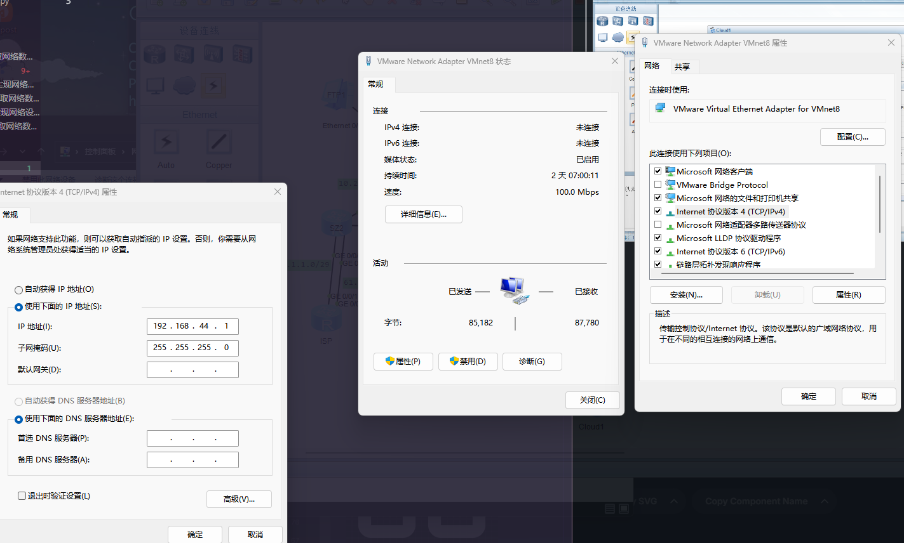
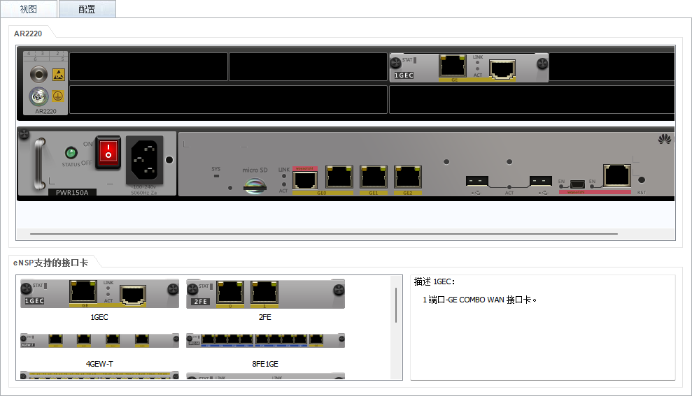
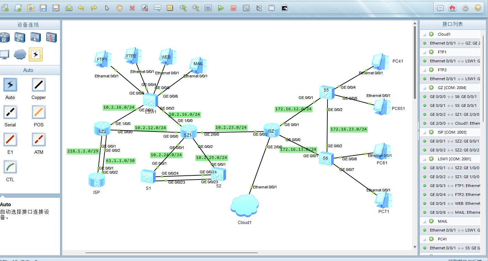
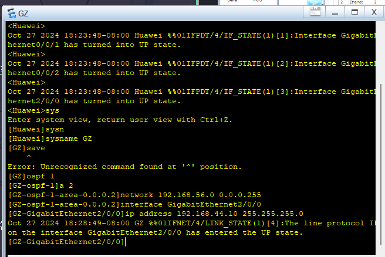
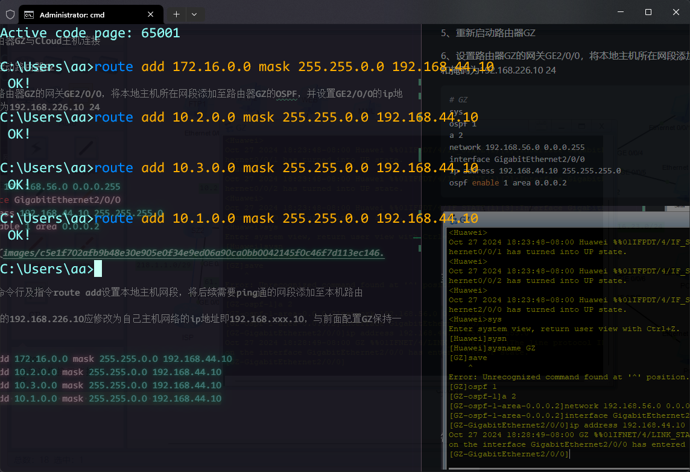
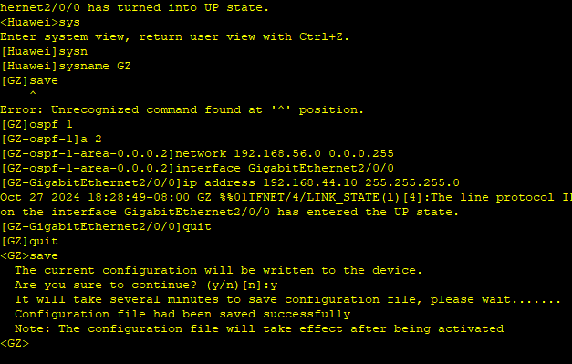
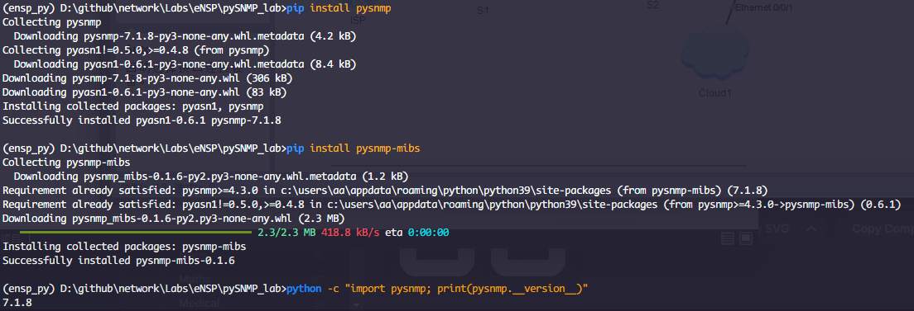
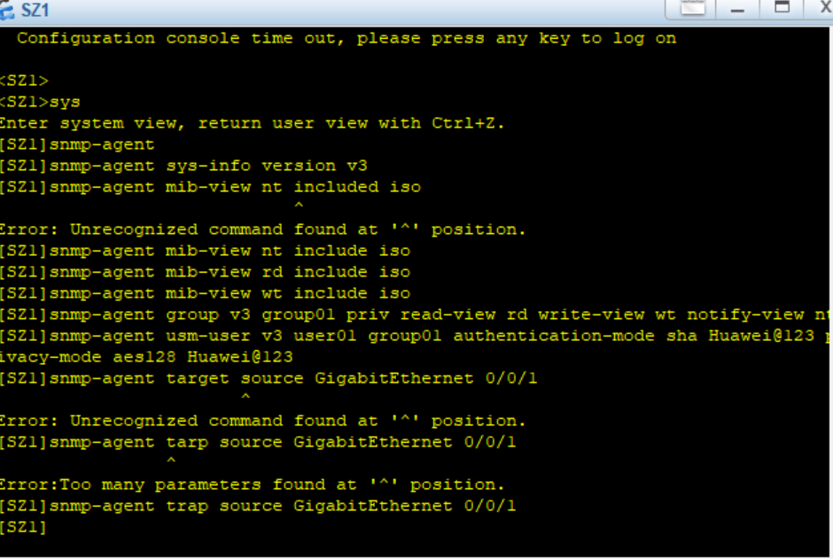

# PySNMP

## 实训6 PySNMP 获取网络数据
专业:计算机网络技术, 课程: 网络系统运行和维护

### 一 实训目标(实验目的)
- 会使用 JSON 格式的数据
- 会使用 netmiko 模块(库)

### 二 实训内容
前期准备操作:
1、使用eNsp软件打开指导教师提供的项目3网络拓扑图,并启动所有设备(已配置过的可以跳过当前准备)：

  
2、添加Cloud主机，并配置端口：
  
  
3、为路由器GZ添加端口：
首先关闭路由器GZ

右击GZ打开设置界面

手动添加端口
  

4、将路由器GZ与Cloud主机连接

5、重新启动路由器GZ
  


6、设置路由器GZ的网关GE2/0/0，将本地主机所在网段添加至路由器GZ的OSPF，并设置GE2/0/0的ip地址和掩码为192.168.226.10 24
```sh
# GZ
sys
ospf 1
a 2
network 192.168.56.0 0.0.0.255
interface GigabitEthernet2/0/0
ip address 192.168.44.10 255.255.255.0
ospf enable 1 area 0.0.0.2
```
  

7、通过命令行及指令route add设置本地主机网段，将后续需要ping通的网段添加至本机路由

注意此处的192.168.226.10应修改为自己主机网络的ip地址即192.168.xxx.10，与前面配置GZ保持一致。
```sh
route add 172.16.0.0 mask 255.255.0.0 192.168.44.10
route add 10.2.0.0 mask 255.255.0.0 192.168.44.10
route add 10.3.0.0 mask 255.255.0.0 192.168.44.10
route add 10.1.0.0 mask 255.255.0.0 192.168.44.10
```
  

完成配置后，退出GZ视图模式，保存相关配置：
```sh
# GZ
quit
save
```
  

（一）安装pysnmp并验证版本（请按要求填写命令，粘贴结果图）
1.通过Anaconda Prompt在虚拟环境ensp_py下安装pysnmp及pysnmp-mibs包，并验证其版本信息。
```sh
# 创建虚拟环境
conda create -n ensp_py python=3.9
# 激活虚拟环境
conda activate ensp_py
# 安装pysnmp
pip install pysnmp
# 安装pysnmp-mibs
pip install pysnmp-mibs
# 验证版本
python -c "import pysnmp; print(pysnmp.__version__)"
```
  

【任务目标】参考实验指导说明书，基于指导
教师给的网络拓扑图Ensp文件，通过PySNMP
获取路由器SZ1和SZ2数据，包括每台路由器
的sysname、接口数目、接口类型、接口IP地
址和掩码、路由目标、路由下一跳。需要完成
的任务如下。
（1）配置SNMPv3。
```sh
# SZ1
display ip interface brief
sys
snmp-agent
snmp-agent sys-info version v3
snmp-agent mib-view nt include iso
snmp-agent mib-view rd include iso
snmp-agent mib-view wt include iso
snmp-agent group v3 group01 priv read-view rd write-view wt notify-view nt
snmp-agent usm-user v3 user01 group01 authentication-mode sha Huawei@123 privacy-mode aes128 Huawei@123
snmp-agent trap source GigabitEthernet 0/0/1
# SZ2 同上
```
  

（2）通过MIB管理工具获取OID。
将获取的 OID 信息 保存到 oid_string.csv 或 cfg.txt
（3）编写Python脚本。
```py
# import pysnmp
# pysnmp.__version__

from pysnmp.hlapi import *
import csv

# 通过函数 use_getCmd() 获取的 OID 值是 一个叶子节点
def use_getCmd(engine, userdata, target, context, oid_str, desc_oid):
    oid = ObjectIdentity(oid_str)
    obj = ObjectType(oid)
    g = getCmd(engine, userdata, target, context, obj)
    errorIndication, errorStatus, errorIndex, varBinds = next(g)
    for i in varBinds:
        print(desc_oid, i) # i 是 ObjectType 对象
    
# 通过 use_bulkCmd() 获取的节点下有 叶子节点 或 一个叶子节点有多个值，需要遍历
def use_bulkCmd(engine, userdata, target, context, oid_str, desc_oid):
    oid = ObjectIdentity(oid_str)
    obj = ObjectType(oid)
    g = bulkCmd(engine, userdata, target, context, 0, 50, obj, lexicographicMode=False)
    MAX_REPES = 500
    count = 0
    while (count<MAX_REPES):
        try:
            errorIndication, errorStatus, errorIndex, varBinds = next(g)
            for i in varBinds:
                print(desc_oid, i)
        # 取完 OID 值后，停止迭代
        except StopIteration:
            break
        count += 1

# 函数 SNMP_init() 用于初始化 SNMP
def SNMP_init(ip):
    snmpEngine = SnmpEngine()
    userdata = UsmUserData('use01', 
                           authKey='Huawei@123',
                           privKey='HuaWei@123',
                            authProtocol=usmHMACSHAAuthProtocol,
                            privProtocol=usmAesCfb128Protocol
                           )
    target = UdpTransportTarget((ip, 161))
    context = ContextData()
    return snmpEngine, userdata, target, context

if __name__ == '__main__':
    # 输入设备管理
    mgmt_ip = input('请输入设备管理 IP 地址：')
    # 初始化 PySNMP 参数
    engine, userdata, target, context = SNMP_init(mgmt_ip)
    try:
        with open("./cfg.txt", "r") as f:
            lines = f.readlines()
            for line in lines:
                temp = line.split('"')
                OID_val = temp[0]
                description_str = temp[1]
                node_flag = temp[2]
                if node_flag == "S":
                    use_getCmd(engine, userdata, target, context, OID_val, description_str)
                elif node_flag == "M":
                    use_bulkCmd(engine, userdata, target, context, OID_val, description_str)
                else:
                    print("something error")
    except Exception as e:
        print(e)
```
（4）运行Python脚本。
```sh
python sc.py
```