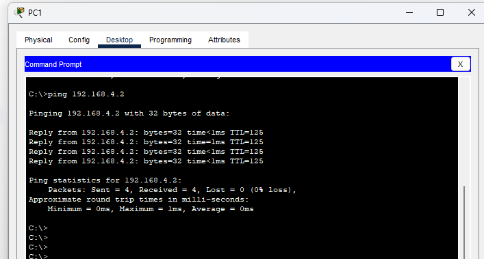

烟台南山学院

科技与数据学院

**《计算机网络课程设计报告》**

**2023－2024－2学期**

**班 级：计算机网络231**

**姓 名：**

**学 号：**

**专 业：计算机网络**

**任课教师：邹秀楠**

1.  **Vlan与Trunk实验**

{width="5.760416666666667in"
height="3.6694444444444443in"}

{width="5.764583333333333in"
height="4.128472222222222in"}

{width="5.768055555555556in"
height="3.167361111111111in"}

+-------------+--------------------------------------------------------+
| *           | 注重过程性考核，目标是检验学生掌握计算机网络组网       |
| *实训目的** | 的理论知识和技能。经过实训后，学生应具备应用思科Packet |
|             | Tracer做组建网络的能力以及                             |
|             | 灵活运用所学的知识、方法与技巧解决实际问题的综合能力。 |
+-------------+--------------------------------------------------------+
| **考        |                                                        |
| 查知识：**  |                                                        |
|             |                                                        |
| 题目涵盖    |                                                        |
| 静态路由、  |                                                        |
| 动态路由、V |                                                        |
| lan、单臂路 |                                                        |
| 由、多端口  |                                                        |
| 路由、端口  |                                                        |
| 聚合、ACL、 |                                                        |
| NAT等知识的 |                                                        |
| 简单应用和  |                                                        |
| 综合应用。  |                                                        |
|             |                                                        |
| **要求：**  |                                                        |
|             |                                                        |
| 1.  共1     |                                                        |
| 2个实验，选 |                                                        |
| 择8个完成即 |                                                        |
| 可及格。实  |                                                        |
| 训报告纸质  |                                                        |
| 版需打印周  |                                                        |
| 五下午当堂  |                                                        |
| 提交。电子  |                                                        |
| 版实训报告  |                                                        |
| 统一交给班  |                                                        |
| 长，收齐后  |                                                        |
| 班长压缩包  |                                                        |
| 发送给我。  |                                                        |
|             |                                                        |
| 2.  选择的  |                                                        |
| 8个实验都要 |                                                        |
| 在实训报告  |                                                        |
| 中按要求提  |                                                        |
| 供截图，同  |                                                        |
| 时至少选择  |                                                        |
| 4个实验展示 |                                                        |
| 所有的配置  |                                                        |
| 命令（参考  |                                                        |
| 指导书）。  |                                                        |
|             |                                                        |
| 3.          |                                                        |
|  如想获得高 |                                                        |
| 分请在实验  |                                                        |
| 中展示个性  |                                                        |
| 化配置，如  |                                                        |
| 将路由器更  |                                                        |
| 名为答题人  |                                                        |
| 的学号后再  |                                                        |
| 进行配置。  |                                                        |
| 或将实验中  |                                                        |
| 的ip修改为  |                                                        |
| 与学号后两  |                                                        |
| 位相关。例  |                                                        |
| 如，你的学  |                                                        |
| 号后两位是  |                                                        |
| 22，那么可  |                                                        |
| 将实验1中的 |                                                        |
| pc1的ip地址 |                                                        |
| 修改为192.1 |                                                        |
| 68.22.2，网 |                                                        |
| 关和路由器R |                                                        |
| 1左下接口地 |                                                        |
| 址修改为192 |                                                        |
| .168.22.1； |                                                        |
| 将PC2的IP地 |                                                        |
| 址修改为192 |                                                        |
| .168.23.2， |                                                        |
| 网关和路由  |                                                        |
| 器R3右下接  |                                                        |
| 口地址修改  |                                                        |
| 为192.168.2 |                                                        |
| 3.1这样最终 |                                                        |
| ping命令pin |                                                        |
| g通的截图是 |                                                        |
| 192.168.22  |                                                        |
| .2ping到192 |                                                        |
| .168.23.2的 |                                                        |
| ，这样可以  |                                                        |
| 确认确实是  |                                                        |
| 本人完成的  |                                                        |
| 实验，我会  |                                                        |
| 给较高的分  |                                                        |
| 数。[<https |                                                        |
| ://www.bili |                                                        |
| bili.com/vi |                                                        |
| deo/BV1Th41 |                                                        |
| 1f7Sj/>（配 |                                                        |
| 置教学链接  |                                                        |
| ）]{.mark}  |                                                        |
|             |                                                        |
| **实        |                                                        |
| 训内容：**  |                                                        |
|             |                                                        |
| 2           |                                                        |
| .  **静态路 |                                                        |
| 由的配置**  |                                                        |
|             |                                                        |
| > {width |                                                        |
| ="5.0083333 |                                                        |
| 33333334in" |                                                        |
| > height="  |                                                        |
| 3.068055555 |                                                        |
| 5555555in"} |                                                        |
| >           |                                                        |
| > 要        |                                                        |
| 求：选用图  |                                                        |
| 示设备搭建  |                                                        |
| 网络拓扑，  |                                                        |
| 按图示要求  |                                                        |
| 配置pc和路  |                                                        |
| 由器各接口  |                                                        |
| 的ip地址。  |                                                        |
| 以静态路由  |                                                        |
| 的方式为每  |                                                        |
| 个路由器的  |                                                        |
| 路由表写入  |                                                        |
| 路由，达到  |                                                        |
| 整个网络互  |                                                        |
| 通的效果。  |                                                        |
| >           |                                                        |
| > 结        |                                                        |
| 果：PC1可以 |                                                        |
| ping通PC2。 |                                                        |
|             |                                                        |
| 3.          |                                                        |
|   **RIP动态 |                                                        |
| 路由配置**  |                                                        |
|             |                                                        |
| > {width |                                                        |
| ="5.5208333 |                                                        |
| 33333333in" |                                                        |
| > height="  |                                                        |
| 3.909027777 |                                                        |
| 7777778in"} |                                                        |
| >           |                                                        |
| > 要求：    |                                                        |
| 选用图示设  |                                                        |
| 备搭建网络  |                                                        |
| 拓扑，按图  |                                                        |
| 示要求配置p |                                                        |
| c和路由器各 |                                                        |
| 接口的ip地  |                                                        |
| 址。使用RI  |                                                        |
| P协议为每个 |                                                        |
| 路由器写入  |                                                        |
| 路由，达到  |                                                        |
| 整个网络互  |                                                        |
| 通的效果。  |                                                        |
| >           |                                                        |
| > 结        |                                                        |
| 果：PC1可以 |                                                        |
| ping通PC2。 |                                                        |
|             |                                                        |
| 4.          |                                                        |
|  **OSPF动态 |                                                        |
| 路由配置**  |                                                        |
|             |                                                        |
| {width |                                                        |
| ="5.4861111 |                                                        |
| 11111111in" |                                                        |
| height=     |                                                        |
| "3.48611111 |                                                        |
| 1111111in"} |                                                        |
|             |                                                        |
| > 要求：    |                                                        |
| 选用图示设  |                                                        |
| 备搭建网络  |                                                        |
| 拓扑，按图  |                                                        |
| 示要求配置p |                                                        |
| c和路由器各 |                                                        |
| 接口的ip地  |                                                        |
| 址。使用OSP |                                                        |
| F协议为每个 |                                                        |
| 路由器划分  |                                                        |
| 区域并写入  |                                                        |
| 路由，达到  |                                                        |
| 整个网络互  |                                                        |
| 通的效果。  |                                                        |
| >           |                                                        |
| > 结        |                                                        |
| 果：PC1可以 |                                                        |
| ping通PC2。 |                                                        |
|             |                                                        |
| 5           |                                                        |
| .  **Vlan与 |                                                        |
| Trunk实验** |                                                        |
|             |                                                        |
| {width |                                                        |
| ="4.9097222 |                                                        |
| 22222222in" |                                                        |
| height=     |                                                        |
| "4.08333333 |                                                        |
| 3333333in"} |                                                        |
|             |                                                        |
| > 要求：    |                                                        |
| 选用图示设  |                                                        |
| 备搭建网络  |                                                        |
| 拓扑，按图  |                                                        |
| 示要求创建v |                                                        |
| lan并将pc机 |                                                        |
| 划入对应vla |                                                        |
| n，按图示配 |                                                        |
| 置pc的ip地  |                                                        |
| 址。达到同v |                                                        |
| lan机器互通 |                                                        |
| > 不同v     |                                                        |
| lan机器不互 |                                                        |
| 通的效果。  |                                                        |
| >           |                                                        |
| > 结        |                                                        |
| 果：PC1可以 |                                                        |
| ping通PC4。 |                                                        |
| >           |                                                        |
| > PC2可以   |                                                        |
| ping通PC5。 |                                                        |
| >           |                                                        |
| > PC3可以   |                                                        |
| ping通PC6。 |                                                        |
| （后两组通  |                                                        |
| 信截图任意  |                                                        |
| 一张即可）  |                                                        |
|             |                                                        |
| 6.          |                                                        |
|  **单臂路由 |                                                        |
| vlan互通**  |                                                        |
|             |                                                        |
| {width |                                                        |
| ="5.6944444 |                                                        |
| 44444445in" |                                                        |
| height=     |                                                        |
| "4.69722222 |                                                        |
| 2222222in"} |                                                        |
|             |                                                        |
| > 要求      |                                                        |
| ：选用图示  |                                                        |
| 设备搭建网  |                                                        |
| 络拓扑，按  |                                                        |
| 图示要求创  |                                                        |
| 建vlan并将p |                                                        |
| c机划入对应 |                                                        |
| vlan，按图  |                                                        |
| 示配置pc的  |                                                        |
| ip地址。达  |                                                        |
| 到使用单臂  |                                                        |
| 路由使vlan1 |                                                        |
| 0和vlan20互 |                                                        |
| 通的效果。  |                                                        |
| >           |                                                        |
| > 结        |                                                        |
| 果：PC1可以 |                                                        |
| ping通PC2。 |                                                        |
|             |                                                        |
| 7.  *       |                                                        |
| *多端口路由 |                                                        |
| vlan互通**  |                                                        |
|             |                                                        |
| {width |                                                        |
| ="4.4159722 |                                                        |
| 22222222in" |                                                        |
| height="    |                                                        |
| 2.965277777 |                                                        |
| 7777777in"} |                                                        |
|             |                                                        |
| > 要        |                                                        |
| 求：选用图  |                                                        |
| 示设备搭建  |                                                        |
| 网络拓扑，  |                                                        |
| 按图示要求  |                                                        |
| 创建vlan10  |                                                        |
| 、vlan20、v |                                                        |
| lan30，将pc |                                                        |
| 1和pc2划入v |                                                        |
| lan10，将pc |                                                        |
| 3和pc4划入v |                                                        |
| lan20，将pc |                                                        |
| 5和pc6划入v |                                                        |
| lan30，按图 |                                                        |
| 示配置pc的  |                                                        |
| ip地址和网  |                                                        |
| 关ip。达到  |                                                        |
| 使用路由器  |                                                        |
| 多个端口互  |                                                        |
| 通vlan10、  |                                                        |
| vlan20、vla |                                                        |
| n30的效果。 |                                                        |
| >           |                                                        |
| > 结果：六  |                                                        |
| 台pc机任意  |                                                        |
| 两台都可以  |                                                        |
| 互相通信。  |                                                        |
| （任选不通  |                                                        |
| vlan的两台  |                                                        |
| PCping通结  |                                                        |
| 果图一张）  |                                                        |
|             |                                                        |
| 8.  **三层  |                                                        |
| 交换机的配  |                                                        |
| 置（一）**  |                                                        |
|             |                                                        |
| {width |                                                        |
| ="5.7361111 |                                                        |
| 11111111in" |                                                        |
| height="    |                                                        |
| 3.663888888 |                                                        |
| 8888888in"} |                                                        |
|             |                                                        |
| > 要求      |                                                        |
| ：选用图示  |                                                        |
| 设备搭建网  |                                                        |
| 络拓扑，按  |                                                        |
| 图示要求创  |                                                        |
| 建vlan2、v  |                                                        |
| lan3、vlan4 |                                                        |
| 、vlan5，将 |                                                        |
| pc划入对应  |                                                        |
| vlan，按图  |                                                        |
| 示配置pc的i |                                                        |
| p地址和网关 |                                                        |
| ip。达到全  |                                                        |
| 网8台pc间任 |                                                        |
| 意两台均互  |                                                        |
| 通的效果。  |                                                        |
| >           |                                                        |
| > 结果      |                                                        |
| ：8台pc机任 |                                                        |
| 意两台都可  |                                                        |
| 以互相通信  |                                                        |
| ，文档中保  |                                                        |
| 留任意两台  |                                                        |
| 不同vlan下  |                                                        |
| 的PC可以pin |                                                        |
| g通的截图。 |                                                        |
|             |                                                        |
| 9.  **三层  |                                                        |
| 交换机的配  |                                                        |
| 置（二）**  |                                                        |
|             |                                                        |
| {wi |                                                        |
| dth="4.0in" |                                                        |
| height="    |                                                        |
| 1.685416666 |                                                        |
| 6666666in"} |                                                        |
|             |                                                        |
| > 要        |                                                        |
| 求：选用图  |                                                        |
| 示设备搭建  |                                                        |
| 网络拓扑，  |                                                        |
| 按图示要求  |                                                        |
| 创建vlan2、 |                                                        |
| vlan3，将pc |                                                        |
| 划入对应vla |                                                        |
| n，按图示配 |                                                        |
| 置pc的ip地  |                                                        |
| 址和网关ip  |                                                        |
| 。达到全vla |                                                        |
| n全pc全网互 |                                                        |
| 通的效果。  |                                                        |
| >           |                                                        |
| >           |                                                        |
|  结果：88台 |                                                        |
| pc机任意两  |                                                        |
| 台都可以互  |                                                        |
| 相通信，文  |                                                        |
| 档中保留pc  |                                                        |
| 4可以ping通 |                                                        |
| pc5的截图。 |                                                        |
|             |                                                        |
| 10. **端口  |                                                        |
| 聚合实验**  |                                                        |
|             |                                                        |
| {width= |                                                        |
| "5.15625in" |                                                        |
| height=     |                                                        |
| "3.89513888 |                                                        |
| 8888889in"} |                                                        |
|             |                                                        |
| > 要求      |                                                        |
| ：选用图示  |                                                        |
| 设备搭建网  |                                                        |
| 络拓扑，按  |                                                        |
| 图示要求创  |                                                        |
| 建vlan10、v |                                                        |
| lan20，将pc |                                                        |
| 划入对应vla |                                                        |
| n，按图示配 |                                                        |
| 置pc的ip地  |                                                        |
| 址。将两个  |                                                        |
| 交换机的G0/ |                                                        |
| 1和G0/2两个 |                                                        |
| 端口聚合成  |                                                        |
| 一个，达到  |                                                        |
| 双倍传输速  |                                                        |
| 率和负载均  |                                                        |
| 衡的效果。  |                                                        |
| >           |                                                        |
| > 结果      |                                                        |
| ：使用show  |                                                        |
| > ether     |                                                        |
| >           |                                                        |
| summary命令 |                                                        |
| 展示聚合后  |                                                        |
| 的group保留 |                                                        |
| 截图。（此  |                                                        |
| 题不用拷贝  |                                                        |
| 配置命令）  |                                                        |
|             |                                                        |
| 11. **标准  |                                                        |
| ACL的配置** |                                                        |
|             |                                                        |
| {width |                                                        |
| ="5.7680555 |                                                        |
| 55555556in" |                                                        |
| height=     |                                                        |
| "4.69722222 |                                                        |
| 2222222in"} |                                                        |
|             |                                                        |
| > 要求：    |                                                        |
| 选用图示设  |                                                        |
| 备搭建网络  |                                                        |
| 拓扑，按图  |                                                        |
| 示要求创建v |                                                        |
| lan10、vlan |                                                        |
| 20，将pc1划 |                                                        |
| 入对应vlan1 |                                                        |
| 0，将pc2和p |                                                        |
| c3划入vlan2 |                                                        |
| 0按图示配置 |                                                        |
| pc的ip地址  |                                                        |
| 和网关ip。  |                                                        |
| 通过写入标  |                                                        |
| 准ACL表，并 |                                                        |
| 将ACL表应用 |                                                        |
| 在Router1的 |                                                        |
| F0/1接口的  |                                                        |
| out方向，实 |                                                        |
| 现pc1和pc2  |                                                        |
| 可以访问ser |                                                        |
| ver0，而pc3 |                                                        |
| 被ACL阻断无 |                                                        |
| 法访问serv  |                                                        |
| er0的效果。 |                                                        |
| >           |                                                        |
| > 结        |                                                        |
| 果：此题展  |                                                        |
| 示两张截图  |                                                        |
| ，第一张pc2 |                                                        |
| >           |                                                        |
|  可以ping通 |                                                        |
| > server0   |                                                        |
| > 通        |                                                        |
| ，第二张pc3 |                                                        |
| > ping      |                                                        |
| >           |                                                        |
| 不通server0 |                                                        |
| > 显示目    |                                                        |
| 的主机不可  |                                                        |
| 达（即显示  |                                                        |
| destination |                                                        |
| > host      |                                                        |
| > un        |                                                        |
| reachable） |                                                        |
| > 。        |                                                        |
+-------------+--------------------------------------------------------+
| > **11.扩展 |                                                        |
| ACL的配置** |                                                        |
| >           |                                                        |
| > {width |                                                        |
| ="5.4395833 |                                                        |
| 33333333in" |                                                        |
| > height=   |                                                        |
| "3.8375in"} |                                                        |
| >           |                                                        |
| > 要求：    |                                                        |
| 选用图示设  |                                                        |
| 备搭建网络  |                                                        |
| 拓扑，按图  |                                                        |
| 示要求创建  |                                                        |
| vlan10、vl  |                                                        |
| an20、vlan3 |                                                        |
| 0、vlan40， |                                                        |
| 将pc1所连网 |                                                        |
| 口划入vlan  |                                                        |
| 10，将pc2所 |                                                        |
| 连网口划入v |                                                        |
| lan20，将pc |                                                        |
| 3所连网口划 |                                                        |
| 入vlan30，  |                                                        |
| 将pc4所连网 |                                                        |
| 口划入vlan4 |                                                        |
| 0。此后按图 |                                                        |
| 示配置pc的i |                                                        |
| p地址和网关 |                                                        |
| ip。通过写  |                                                        |
| 入扩展ACL表 |                                                        |
| ，做到访问  |                                                        |
| 控制，最终  |                                                        |
| 实现只有pc  |                                                        |
| 2和pc3互相p |                                                        |
| ing不通，其 |                                                        |
| 他机器之间  |                                                        |
| 通信不受影  |                                                        |
| 响的效果。  |                                                        |
| >           |                                                        |
| > 结        |                                                        |
| 果：此题展  |                                                        |
| 示两张截图  |                                                        |
| ，第一张pc2 |                                                        |
| > 可        |                                                        |
| 以ping通pc4 |                                                        |
| ，第二张pc2 |                                                        |
| > ping      |                                                        |
| > 不通pc3。 |                                                        |
| >           |                                                        |
| > **12.D    |                                                        |
| HCP的配置** |                                                        |
| >           |                                                        |
| > {width |                                                        |
| ="4.5555555 |                                                        |
| 55555555in" |                                                        |
| > height=   |                                                        |
| "4.06041666 |                                                        |
| 6666667in"} |                                                        |
| >           |                                                        |
| > 要求      |                                                        |
| ：选用图示  |                                                        |
| 设备搭建网  |                                                        |
| 络拓扑，按  |                                                        |
| 图示要求创  |                                                        |
| 建vlan10、  |                                                        |
| vlan20、vla |                                                        |
| n30、，将pc |                                                        |
| 1所连网口划 |                                                        |
| 入vlan10，  |                                                        |
| 将pc2所连网 |                                                        |
| 口划入vlan  |                                                        |
| 20，将pc3所 |                                                        |
| 连网口划入v |                                                        |
| lan30。此后 |                                                        |
| 按图示配置  |                                                        |
| 三层交换机  |                                                        |
| 和路由器各  |                                                        |
| 接口的ip地  |                                                        |
| 址，此后使  |                                                        |
| 用静态路由  |                                                        |
| 配置三层交  |                                                        |
| 换机和路由  |                                                        |
| 器的路由表  |                                                        |
| ，并在三层  |                                                        |
| 交换机中配  |                                                        |
| 置三vlan的  |                                                        |
| 网关，创建  |                                                        |
| 三个dhcp地  |                                                        |
| 址池，最终  |                                                        |
| 实现pc1、p  |                                                        |
| c2和pc3互均 |                                                        |
| 能自动从dhc |                                                        |
| p地址池中获 |                                                        |
| 取到对应的i |                                                        |
| p地址，子网 |                                                        |
| 掩码，默认  |                                                        |
| 网关和DNS服 |                                                        |
| 务器地址。  |                                                        |
| >           |                                                        |
| > 结果：此  |                                                        |
| 题展示三张  |                                                        |
| 截图，第一  |                                                        |
| 张pc1可以自 |                                                        |
| 动获取ip地  |                                                        |
| 址，第二张  |                                                        |
| pc2可以自动 |                                                        |
| 获取ip地址  |                                                        |
| ，第三张pc  |                                                        |
| 3可以自动获 |                                                        |
| 取ip地址。  |                                                        |
+-------------+--------------------------------------------------------+
